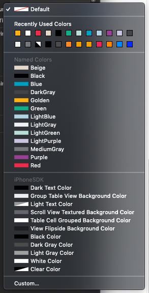

# HMHColors

[](https://travis-ci.org/theMikeSwan-HMH/HMHColors)
[](https://cocoapods.org/pods/HMHColors)
[](https://cocoapods.org/pods/HMHColors)
[](https://cocoapods.org/pods/HMHColors)

## Example

To run the example project, clone the repo, and run `pod install` from the Example directory first.

## Requirements
- Swift 5.0
- iOS 11.0+

## Installation

HMHClassKitHelper is available through a private CocoaPods spec repo, [HMHPods](https://github.com/theMikeSwan-HMH/HMHPods.git). To install the pod: 

If you do not yet have the HMHPods repo on your machine you will need to add it first:

```bash
pod repo add HMHPods https://github.com/theMikeSwan-HMH/HMHPods.git
```

Once the HMHPods repo is on your local machine you need to add it and the default spec repo to your Podfile. (Note that if you are not using any public pods you can skip the first line but if someone goes to add a public repo later they may be confused as tp why it doesn't work.)

Add the following lines to the top of your Podfile:

```ruby
source 'https://github.com/CocoaPods/Specs.git'
source 'https://github.com/theMikeSwan-HMH/HMHPods.git'
```
In the desired target(s) of your Podfile:


```ruby
pod 'HMHColors'
```

## Usage
You can use the colors from code with :

``` swift
someView.backgroundColor = HMHColors.golden.color()
```

You can also select the colors directly in the Interface Builder portion of Xcode under the 'Named Colors' section.



## Author

theMikeSwan-HMH, michael.swan@hmhco.com

## License

HMHColors is available under the MIT license. See the LICENSE file for more info.
